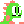
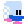

# Bubble-Bobble-Sprite

here there are some sprite for bubble bobble, if u want them all check [this file](res/Bubble_Bobble_Arcade.png)

### Menu contains all sprites of the logo (178x144)

[menuz.png](res/menu/menuz.png) contains 4 sprite (the original ones i guess) (712x144)

Level 1 map is in blue and green, r.value = 0 for the blue, and 3 for the green (32x28) [Map1_Info_32x28.png](res/block_and_map1/Map1_Info_32x28.png)

Sprite of 28 blocks, 8x8 each [Blockssprite_8x8.png](res/block_and_map1/Blockssprite_8x8.png)

##  Player1

contains:
- IDLE
- UP
- DOWN
- LEFT
- RIGHT
- DEAD
- SHOOTING (shooting animation of the player not the bubble)

matrix = 6 rows x 4 columns (64x96) (16x16 each)

##  Zen-Chan 
contains:
- normal, red, and blue IDLE animation
- green, blue and red IN_BUBBLE animation
- death animation

matrix = 7 rows x 4 columns (64x112) (16x16 each)

